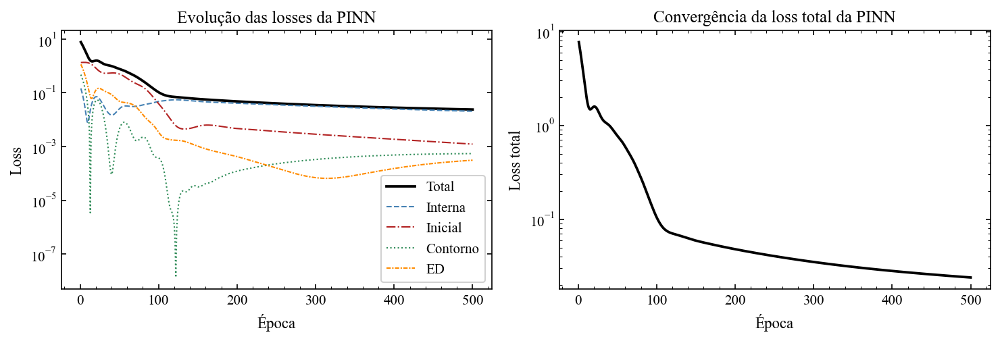
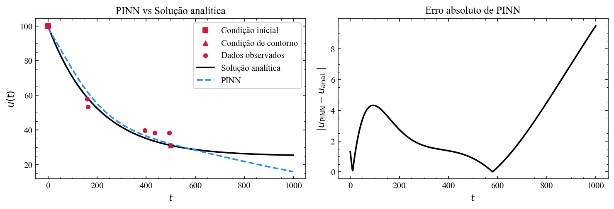
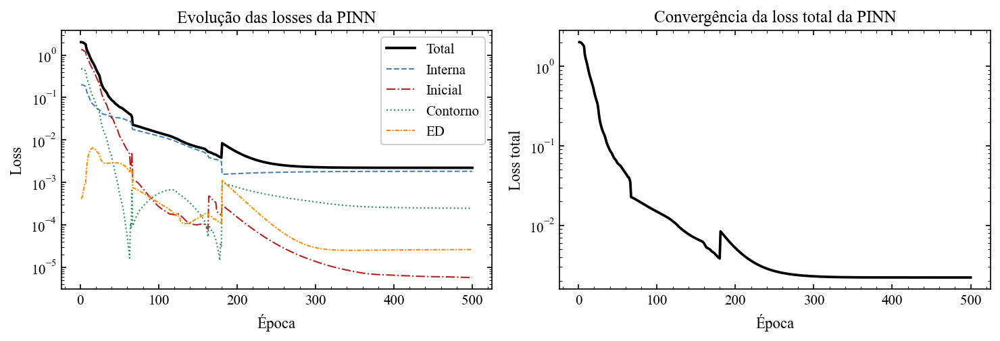
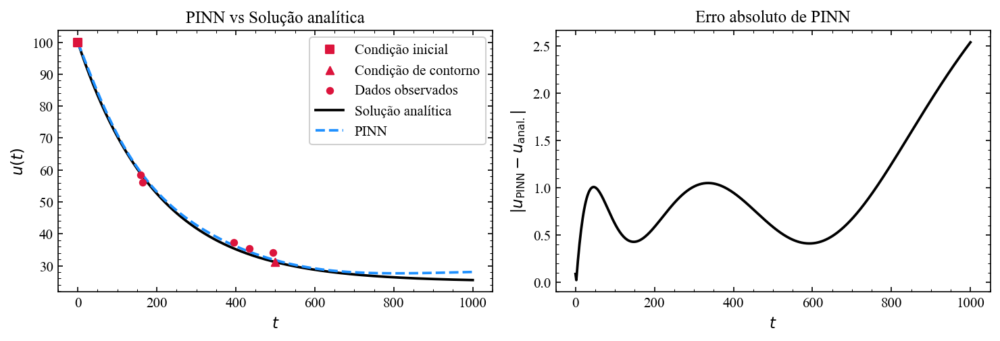

<h1 align="center">
Introdução às PINNs: Redes Neurais Informadas por Física
</h1>

  <i>Physics-Informed Neural Networks aplicadas à resolução direta e inversa de Equações Diferenciais usando PyTorch.</i>

  
  
  

---

# Sobre o repositório

Este repositório contém um material didático introdutório sobre **Physics-Informed Neural Networks (PINNs)** desenvolvido durante a disciplina de Redes Neurais do curso de **Bacharelado Interdisciplinar em Ciência e Tecnologia** da Ilum - Escola de Ciência.

O objetivo do projeto é apresentar, de forma gradual e transparente, como redes neurais podem incorporar leis físicas expressas por Equações Diferenciais Ordinárias (EDOs) através de diferenciação automática em PyTorch.

Ao longo dos notebooks, são abordados:

- fundamentos de MLPs em PyTorch;
- diferenciação automática;
- construção da loss física;
- PINNs para problemas diretos;
- PINNs para problemas inversos;
- treinamento com L-BFGS;
- comparação com soluções analíticas.

---

# Conhecimentos prévios recomendados

Para melhor aproveitamento do material, recomenda-se familiaridade com:

- cálculo diferencial;
- Equações Diferenciais Ordinárias;
- redes neurais básicas (MLP);
- PyTorch.

---

# O que são PINNs?

As **Physics-Informed Neural Networks (PINNs)** são redes neurais treinadas não apenas com dados experimentais, mas também utilizando restrições físicas impostas por Equações Diferenciais.

Em vez de aprender apenas pares entrada-saída, a rede também minimiza o resíduo físico da equação:

$$
\mathcal{R}(u_\theta)=0
$$

onde $u_\theta$ representa a solução aproximada produzida pela rede neural.

A função de perda geral utilizada possui a forma:

$$
ℒ = ℒ_{dados} + λℒ_{física}
$$

com:

- $ℒ_{dados}$: erro nos dados observados;
- $ℒ_{física}$: erro no resíduo da equação diferencial;
- $λ$: peso da restrição física.

---

# Conteúdos do repositório

Este repositório possui <i>Jupyter Notebooks</i> didáticos que compõem um tutorial introdutório sobre PINNs.

<ul>
  <li> :file_folder: <b>Codigos</b>: contém os notebooks e arquivos auxiliares utilizados ao longo do projeto.</li>
    <ul>
      <li> :page_facing_up: <b>Basica_PINN.ipynb</b>: notebook introdutório sobre os fundamentos das PINNs, apresentando uma aplicação à Lei de Resfriamento de Newton.</li>
      <li> :page_facing_up: <b>Inversa_PINN.ipynb</b>: notebook sobre problemas inversos utilizando PINNs para inferência de parâmetros físicos da equação diferencial.</li>
      <li> :page_facing_up: <b>NeuralNetworks.py</b>: implementação das arquiteturas neurais utilizadas no projeto, incluindo a MLP tradicional e a PINN desenvolvida nos notebooks.</li>
      <li> :page_facing_up: <b>funcoes.py</b>: funções auxiliares para normalização, geração de malhas, soluções analíticas, previsões e visualização de resultados.</li>
    </ul>
  <li> :file_folder: <b>Imagens</b>: contém imagens utilizadas no material e resultados obtidos durante os experimentos.</li>
  <ul>
    <li> :framed_picture: <b>Cabecalho.png</b>: imagem utilizada no cabeçalho do README.</li>
    <li> :framed_picture: <b>Rede.png</b>: ilustração esquemática da arquitetura da MLP.</li>
    <li> :file_folder: <b>Resultados</b>: gráficos gerados pelos modelos.</li>
    <ul>
      <li> :file_folder: <b>Basico</b>: resultados do notebook <i>Basica_PINN.ipynb</i>.</li>
      <li> :file_folder: <b>Inverso</b>: resultados do notebook <i>Inversa_PINN.ipynb</i>.</li>
    </ul>
  </ul>
</ul>

---

# Exemplos de resultados

Os notebooks do repositório geram gráficos para análise do treinamento, convergência e qualidade das soluções obtidas pelas PINNs.

Os resultados incluem:

- evolução das componentes da função de perda;
- comparação entre PINN e solução analítica;
- erro absoluto;
- inferência de parâmetros físicos em problemas inversos.

## Resultados — PINN Básica

A PINN básica é aplicada à Lei de Resfriamento de Newton para aproximar a solução da Equação Diferencial Ordinária:

$$
\frac{dT}{dt} = r(T_{amb} - T)
$$

com restrições físicas incorporadas diretamente na função de perda.

### Evolução das losses

  

O gráfico acima mostra a evolução temporal das diferentes componentes da função de perda durante o treinamento:

- **Loss interna**: erro nos dados observados;
- **Loss inicial**: erro associado à condição inicial;
- **Loss de contorno**: erro associado à condição de contorno;
- **Loss da ED**: erro do resíduo físico da equação diferencial;
- **Loss total**: combinação ponderada de todas as componentes.

A convergência simultânea dessas perdas indica que a rede neural não apenas ajusta os dados observados, mas também aprende uma solução consistente com a física do problema.

### Comparação com solução analítica

  

A figura acima compara:

- os dados observados;
- a solução analítica da EDO;
- a solução aproximada pela PINN.

O painel à direita mostra o erro absoluto da aproximação ao longo do domínio temporal.

Os resultados evidenciam que a PINN consegue reproduzir adequadamente a dinâmica do sistema físico mesmo utilizando poucos dados observacionais.

## Resultados — PINN Inversa

Na PINN inversa, além de aproximar a solução da EDO, a rede neural também aprende parâmetros físicos da equação diferencial diretamente dos dados experimentais.

Neste caso, parâmetros da física são tratados como parâmetros treináveis da rede.

### Evolução das losses

  

O comportamento das losses no problema inverso é mais complexo devido à otimização simultânea de parâmetros da rede neural e parâmetros físicos da equação diferencial. A convergência das perdas indica aprendizado simultâneo da solução e dos parâmetros físicos do sistema.

### Comparação com solução analítica

  

O modelo inverso consegue reconstruir a dinâmica física do sistema enquanto estima parâmetros desconhecidos da equação diferencial. O erro absoluto mostra a qualidade da aproximação obtida pela PINN ao longo do domínio.

Nota: Os resultados da PINN inversa parecem melhores que o da PINN básica, pois há uma diferença nos otimizadores usados. Isso é discutido nos *notebooks*.

---

# Professor orientador

<table>
  <tr>
    <td align="center">
      <a href="https://github.com/drcassar">
         
        <b>Prof. Dr. Daniel R. Cassar</b>
      </a>
    </td>
  </tr>
</table>

---

# Autor

<table>
  <tr>
    <td align="center">
      <a href="https://github.com/Giulio-Roux">
         
        <b>Giulio Oertel Spinelli Roux César</b>
      </a>
    </td>
  </tr>
</table>
